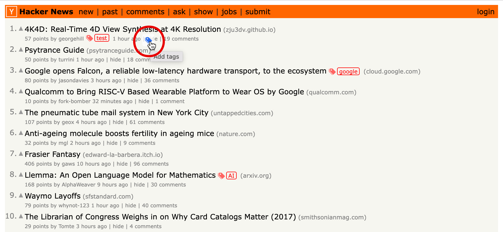
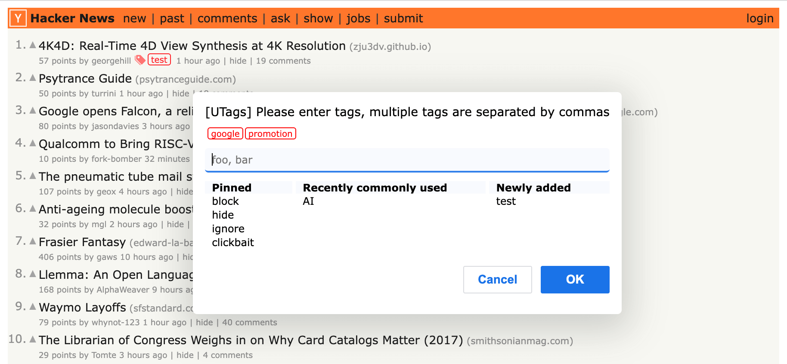
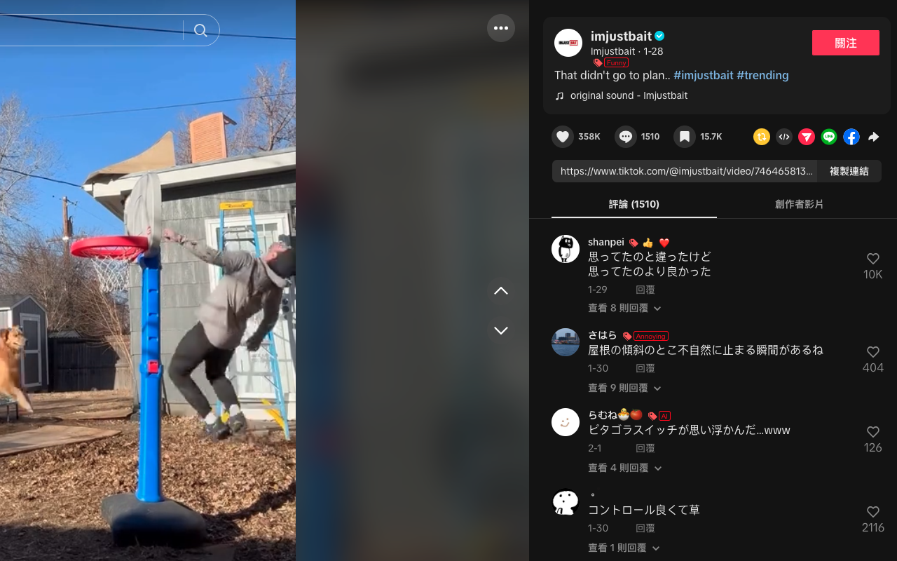

# UTags - 通用标签系统

[](https://github.com/utags/utags/blob/main/LICENSE)
[](https://github.com/utags/utags/actions)
[](https://utags.link)

> [English](README.md) | 中文

## 🚀 项目概览

**UTags** 是一个全面的标签生态系统，彻底改变您组织和管理网络内容的方式。这个 monorepo 包含两个互补的应用程序：

- **🏷️ UTags 扩展/用户脚本**：为网络上的链接、用户、帖子和视频添加自定义标签和备注
- **📚 UTags 书签管理器**：具有强大筛选功能的现代化网络书签管理应用

它们共同提供了一个完整的解决方案，以前所未有的灵活性和控制力来组织、标记和管理您的数字内容。

🌐 [体验 UTags](https://utags.link/) | 📦 [安装浏览器扩展](https://utags.link/c/public/utags-downloads-zh)

## 📁 仓库结构

```
utags/
├── packages/
│   ├── extension/          # 浏览器扩展和用户脚本
│   └── webapp/             # 基于网络的书签管理器
├── docs/                   # 文档
├── assets/                 # 共享资源和截图
└── custom-style-examples/  # CSS 自定义示例
```

## ✨ 核心特性

### 🌐 通用网络标签

- 在 50+ 网站上为用户、帖子、视频和链接添加标签
- 具有筛选效果的特殊标签（隐藏、屏蔽、收藏等）
- 通过 GitHub 和 WebDAV 进行跨平台同步
- 支持 Chrome、Firefox、Edge 和用户脚本管理器

### 📊 高级书签管理

- 支持 AND/OR/NOT 逻辑的强大筛选引擎
- 层级标签组织
- 实时搜索和渐进式筛选
- 数据可视化和使用分析
- PWA 支持离线访问

### 🔄 无缝集成

- 扩展和网络应用之间的自动同步
- 从主流浏览器导入/导出
- 用于自定义集成的开放 API
- 多语言支持（12+ 种语言）

## 🚀 快速开始

### 选项 1：使用两个组件（推荐）

1. **安装扩展**：

   - [Chrome 应用商店](https://chromewebstore.google.com/detail/utags-add-usertags-to-lin/kofjcnaphffjoookgahgjidofbdplgig)
   - [Firefox 附加组件](https://addons.mozilla.org/firefox/addon/utags/)
   - [Edge 附加组件](https://microsoftedge.microsoft.com/addons/detail/utags-add-usertags-to-l/bhlbflbehfoccjjenpekilgabbjjnphe)
   - [用户脚本](https://greasyfork.org/scripts/460718-utags-add-usertags-to-links)

2. **访问网络应用**：访问 [https://utags.link](https://utags.link) 进行高级书签管理

3. **开始标记**：在浏览时添加标签，在网络应用中管理它们

### 选项 2：仅使用扩展

安装浏览器扩展，在浏览网站时直接添加标签。

### 选项 3：仅使用网络应用

使用 [网络应用程序](https://utags.link) 进行书签管理，无需扩展。

## 📦 子项目

### 🏷️ UTags 扩展

**位置**：[`packages/extension/`](packages/extension/)

一个浏览器扩展和用户脚本，可在 50+ 支持的网站上为网络内容添加标签。

#### 支持的网站

- **社交媒体**：X (Twitter)、Reddit、Facebook、Instagram、Threads、TikTok、YouTube
- **开发平台**：GitHub、Greasy Fork、Hacker News、Stack Overflow
- **中文网站**：Bilibili、知乎、微博、抖音、小红书、V2EX
- **论坛**：Discourse、Flarum、NGA、Linux.do、NodeSeek
- **以及 30+ 其他网站**

#### 主要功能

- 🏷️ **智能标记**：为用户、帖子、视频和链接添加标签
- 🎯 **特殊标签**：使用 `block`、`hide`、`favorite` 等标签进行内容筛选
- 📱 **触屏支持**：在移动浏览器上工作
- 🔄 **自动同步**：跨设备同步数据
- 🎨 **可自定义**：应用自定义样式和主题
- 🌍 **多语言**：支持 12+ 种语言

#### 安装方式

- **Chrome**：[Chrome 应用商店](https://chromewebstore.google.com/detail/utags-add-usertags-to-lin/kofjcnaphffjoookgahgjidofbdplgig)
- **Firefox**：[Firefox 附加组件](https://addons.mozilla.org/firefox/addon/utags/)
- **Edge**：[Edge 附加组件](https://microsoftedge.microsoft.com/addons/detail/utags-add-usertags-to-l/bhlbflbehfoccjjenpekilgabbjjnphe)
- **用户脚本**：[Greasy Fork](https://greasyfork.org/scripts/460718-utags-add-usertags-to-links)

#### 使用方法

1. 将鼠标悬停在用户名、帖子标题或链接上
2. 点击出现的 🏷️ 标签图标
3. 添加用逗号分隔的标签
4. 使用特殊标签获得筛选效果

---

### 📚 UTags 书签管理器

**位置**：[`packages/webapp/`](packages/webapp/)

一个现代化的网络应用程序，具有强大的标记和筛选功能，用于高级书签管理。

#### 核心特性

- 🔍 **高级筛选**：AND/OR/NOT 逻辑、正则表达式支持、渐进式筛选
- 🏷️ **层级标签**：使用 `父标签/子标签/孙标签` 结构组织
- 📊 **数据可视化**：使用统计和分析仪表板
- 🔄 **多平台同步**：GitHub 和 WebDAV 同步
- 📱 **PWA 支持**：离线访问，添加到主屏幕
- 🌓 **主题**：明暗模式支持
- 🌍 **响应式**：完美适配桌面和移动设备

#### 产品优势

- ✅ **完全免费**：MIT 许可证，无需注册
- ✅ **无广告**：干净、专注的体验
- ✅ **无限书签**：无存储限制
- ✅ **隐私优先**：本地数据存储，用户控制
- ✅ **可自托管**：部署到您自己的服务器
- ✅ **跨浏览器**：适用于所有现代浏览器

#### 在线实例

- [https://utags.link](https://utags.link/)（主要）
- [https://utags.top](https://utags.top/)
- [https://utags.github.io](https://utags.github.io/)

#### 自托管

**快速部署**：

```bash
# 克隆并构建
git clone https://github.com/utags/utags.git
cd utags/packages/webapp
npm install && npm run build

# 将 dist/ 文件夹部署到您的网络服务器
```

**预构建版本**：

```bash
# 克隆预构建文件
git clone -b gh-pages --single-branch https://github.com/utags/utags.git utags-bookmarks-dist
cd utags-bookmarks-dist
# 部署到您的网络服务器
```

## 🛠 开发

Wiki: [开发指南](https://zread.ai/utags/utags)

### 前置要求

- Node.js 18+
- pnpm 8+

### 设置

```bash
# 克隆仓库
git clone https://github.com/utags/utags.git
cd utags

# 安装依赖
pnpm install

# 构建所有包
pnpm run build

# 运行测试
pnpm test
```

### 特定包的开发

**扩展开发**：

```bash
cd packages/extension
pnpm dev          # 开发构建
pnpm build        # 生产构建
pnpm package      # 创建分发包
```

**网络应用开发**：

```bash
cd packages/webapp
pnpm dev          # 在 http://localhost:5173 启动开发服务器
pnpm build        # 生产构建
pnpm preview      # 预览生产构建
pnpm package      # 创建分发包
```

### 可用脚本

- `pnpm format` - 格式化所有代码
- `pnpm lint` - 检查并修复问题
- `pnpm build` - 构建所有包
- `pnpm package` - 打包所有分发版本
- `pnpm test` - 运行测试

## 📸 截图


_为用户和帖子添加标签_


_高级筛选和标签管理_


_具有筛选效果的特殊标签_

## 🛣 发展路线图

### 扩展

- [ ] 自定义网站规则编辑器
- [ ] 高级标签样式选项
- [ ] 社区标签分享
- [ ] AI 驱动的标签建议

### 网络应用

- [ ] 移动应用（React Native）
- [ ] 高级笔记功能
- [ ] 团队协作功能
- [ ] API 市场

### 共享

- [ ] 实时同步改进
- [ ] 增强安全功能
- [ ] 插件生态系统
- [ ] 企业功能

## 🤝 贡献

我们欢迎贡献！请查看我们的[贡献指南](CONTRIBUTING.zh-CN.md)了解详情。

### 贡献方式

- 🐛 [报告错误](https://github.com/utags/utags/issues)
- 💡 [请求功能](https://github.com/utags/utags/issues)
- 🔧 [提交拉取请求](https://github.com/utags/utags/pulls)
- 📖 [改进文档](https://github.com/utags/utags/tree/main/docs)
- 🌍 [帮助翻译](https://github.com/utags/utags/tree/main/packages/webapp/messages)

## 📄 许可证

版权所有 (c) 2023-2026 [Pipecraft](https://www.pipecraft.net)。基于 [MIT 许可证](https://github.com/utags/utags/blob/main/LICENSE) 授权。

## 🔗 链接

- 🌐 **官方网站**：[https://utags.link](https://utags.link)
- 📦 **Chrome 扩展**：[Chrome 应用商店](https://chromewebstore.google.com/detail/utags-add-usertags-to-lin/kofjcnaphffjoookgahgjidofbdplgig)
- 🦊 **Firefox 附加组件**：[Firefox 附加组件](https://addons.mozilla.org/firefox/addon/utags/)
- 📜 **用户脚本**：[Greasy Fork](https://greasyfork.org/scripts/460718-utags-add-usertags-to-links)
- 💬 **讨论**：[GitHub 讨论](https://github.com/utags/utags/discussions)
- 📺 **视频演示**：[YouTube](https://www.youtube.com/watch?v=WzUzBA5V91A)

---

[](https://www.pipecraft.net)
[](https://utags.link)
