import BrowserWindow from '@site/src/components/BrowserWindow';

# 快速入门

本章节将帮助您快速上手 UTags，包括安装、基本设置和首次使用指南。

## 安装指南

### 浏览器扩展与用户脚本的选择

UTags 插件支持浏览器扩展与用户脚本两种安装方式，您只需安装其中之一即可，它们的**基本功能**是相同的。在选择时可以参考以下区别：

- **浏览器扩展**：功能更加丰富，与浏览器集成度更高
- **用户脚本**：版本更新更加及时，适合喜欢尝鲜的用户

根据您的使用习惯和需求选择适合自己的安装方式。

### 浏览器扩展安装

UTags 浏览器扩展支持 Chrome、Firefox、Edge 等主流浏览器，安装步骤如下：

- **Chrome**：[Chrome Web Store](https://chromewebstore.google.com/detail/utags-add-usertags-to-lin/kofjcnaphffjoookgahgjidofbdplgig)
- **Firefox**：[Firefox Add-ons](https://addons.mozilla.org/firefox/addon/utags/)
- **Edge**：[Edge Add-ons](https://microsoftedge.microsoft.com/addons/detail/utags-add-usertags-to-l/bhlbflbehfoccjjenpekilgabbjjnphe)

安装步骤：

1. 点击上述对应浏览器的链接
2. 在扩展商店页面点击"添加到浏览器"或"安装"按钮
3. 确认安装
4. 安装完成后，浏览器工具栏会出现 UTags 图标
5. 建议将 UTags 图标固定在工具栏中，方便日常使用（右键点击图标，选择"固定到工具栏"或类似选项）

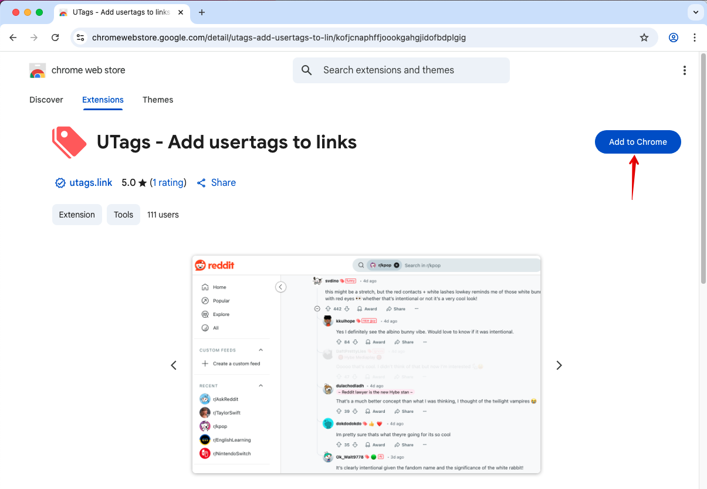
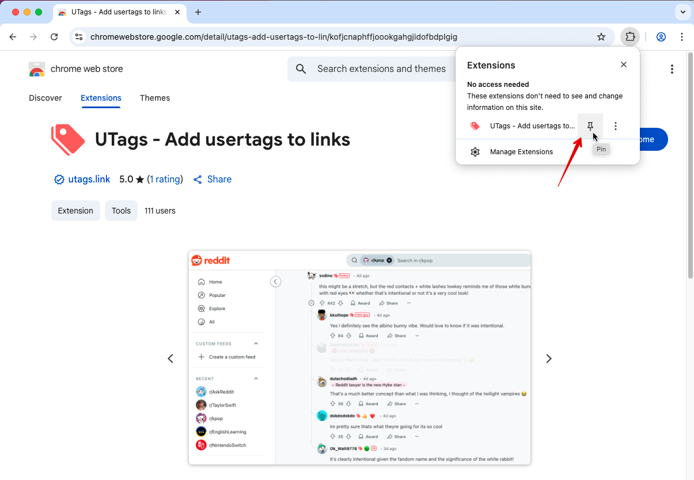

### 用户脚本安装

用户脚本是一种轻量级的浏览器扩展方式，适合那些希望保持浏览器轻量化或不想安装完整扩展的用户。UTags 提供了功能完整的用户脚本版本，您可以通过以下步骤安装：

#### 前置条件

1. **安装用户脚本管理器**：您需要先安装以下任一用户脚本管理器：
   - [Tampermonkey](https://www.tampermonkey.net/)（推荐，支持所有主流浏览器）
   - [Violentmonkey](https://violentmonkey.github.io/)（开源选择，适合 Firefox/Chrome）
   - [ScriptCat](https://scriptcat.org/)（国产脚本管理器，中文界面）
     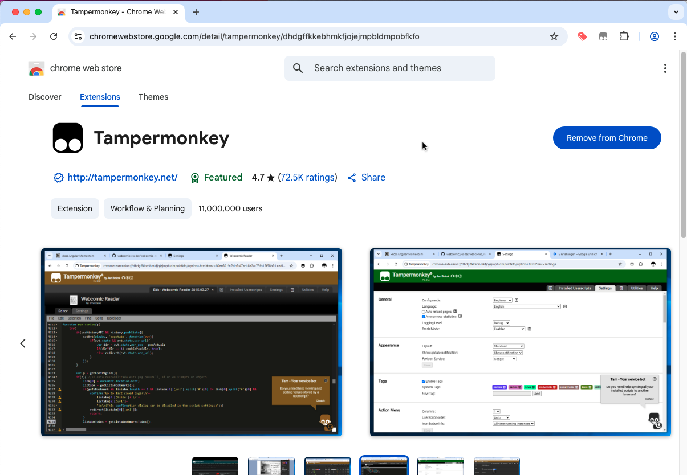

#### 安装步骤

1. 访问以下任一 UTags 用户脚本发布页面：
   - [Greasy Fork - UTags](https://greasyfork.org/scripts/460718-utags-add-usertags-to-links)（国际用户脚本平台）
   - [ScriptCat - UTags](https://scriptcat.org/script-show-page/2784)（中文用户脚本平台）

2. 点击页面上的"安装此脚本"或"Install this script"按钮
   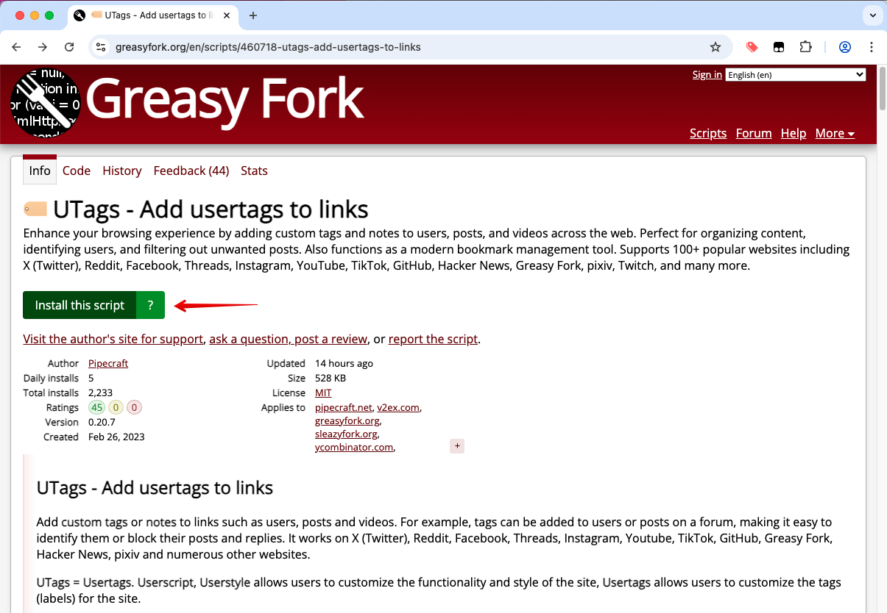

3. 在弹出的用户脚本管理器窗口中确认安装
   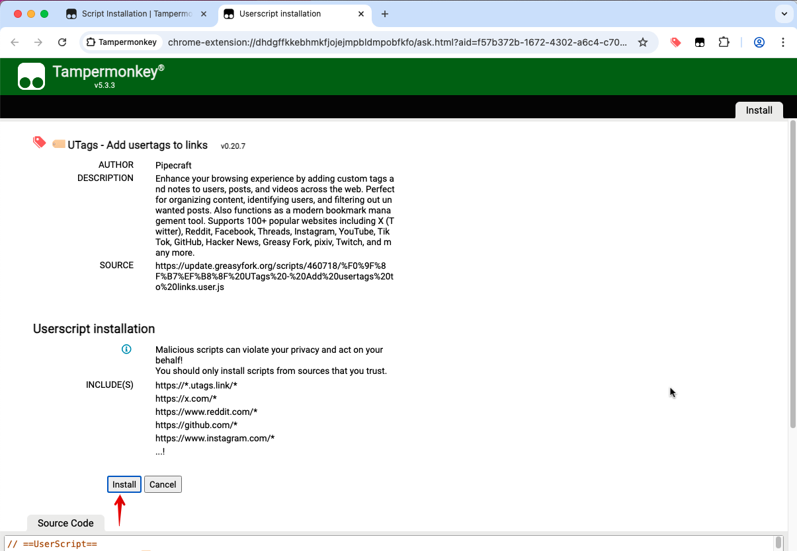

4. 安装完成后，刷新网页以激活脚本

5. 验证安装：刷新刚刚访问的 Greasy Fork 或 ScriptCat 页面，您应该能看到 UTags 的"设置"命令菜单
   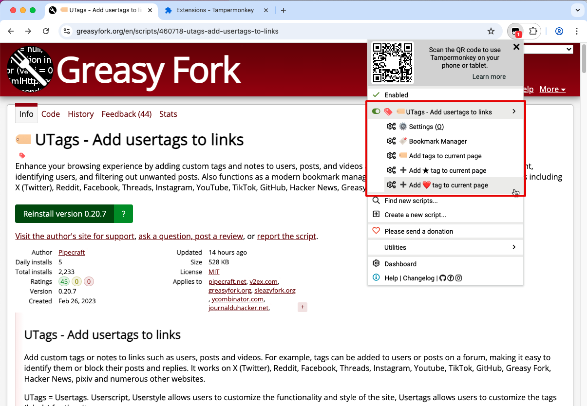

#### 用户脚本权限设置

如果您发现安装后用户脚本没有在网页中生效，请检查以下设置：

1. **开启浏览器的开发者模式**（部分浏览器需要）：
   - **Chrome**：访问 `chrome://extensions/`，勾选右上角的"开发者模式"
   - **Edge**：访问 `edge://extensions/`，打开"开发人员模式"
   - **Firefox**：访问 `about:addons`，点击扩展，然后点击设置图标，选择"调试附加组件"

2. **检查脚本管理器权限**：
   - 在脚本管理器的设置页面，确保"允许用户脚本"或"Allow User Scripts"已启用
   - 确认脚本管理器的网站访问权限设置正确（通常需要"所有网站"权限）
   - 检查 UTags 脚本是否被禁用或处于暂停状态

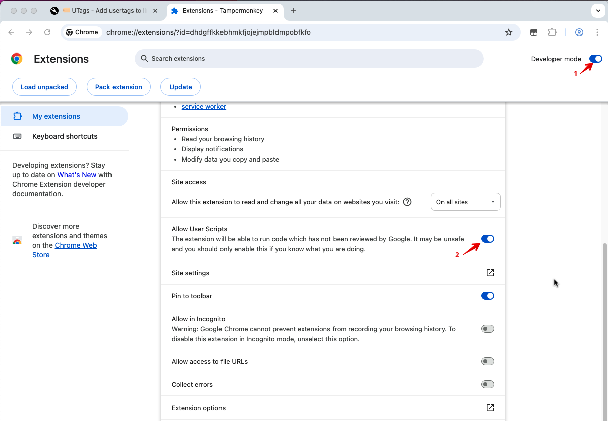

#### 故障排除

- **脚本未生效**：尝试重启脚本管理器，重启浏览器，或检查脚本管理器的控制台是否有错误信息
- **权限问题**：某些网站可能限制用户脚本执行，尝试在脚本管理器中为该网站单独设置权限

### 网页应用访问

UTags 网页应用（书签管理器）不需要安装，您可以直接通过以下链接访问：

- 主站：[https://utags.link](https://utags.link/)
- 备用站点：
  - [https://utags.top](https://utags.top/)
  - [https://utags.github.io](https://utags.github.io/)

您也可以将网页应用添加到主屏幕，实现类似原生应用的体验：

1. 访问 UTags 网页应用
2. 在浏览器菜单中选择"添加到主屏幕"或"安装应用"
3. 按照提示完成安装

### 浏览器扩展或用户脚本与网页应用间的数据同步配置

- 安装扩展或用户脚本后访问网页应用首次使用会自动添加。

<BrowserWindow url="https://utags.link/">
  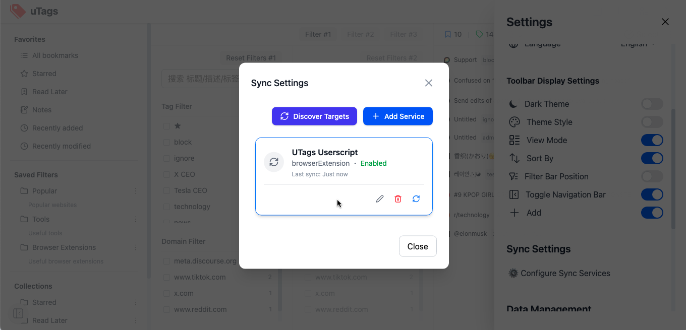
</BrowserWindow>

如果没有自动添加时：

- 打开网页应用 > 设置 > Sync Settings，点击 Discover Targets
- 查看是否有新的插件出现，有的话点击添加

<BrowserWindow url="https://utags.link/">
  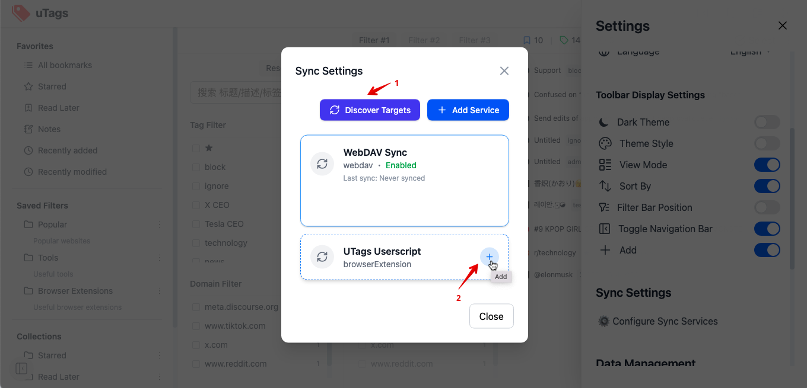
</BrowserWindow>
- 然后点击 "Sync Now" 按钮完成同步

<BrowserWindow url="https://utags.link/">
  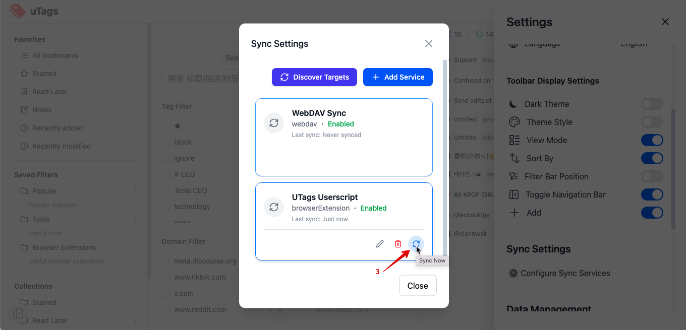
</BrowserWindow>

## 首次使用指南

### 使用浏览器扩展/用户脚本添加标签

1. 访问任何支持的网站（如 Twitter、Reddit、GitHub 等）
2. 将鼠标悬停在用户名、帖子标题或链接上

   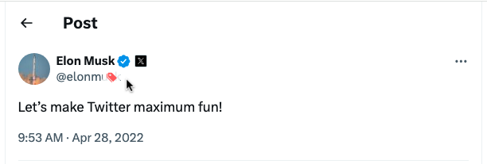

3. 点击出现的 🏷️ 标签图标
4. 在弹出的输入框中输入标签，多个标签用逗号分隔

   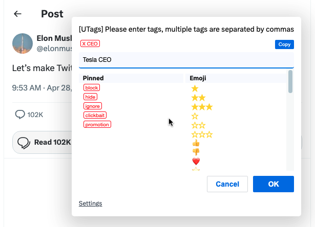

5. 按回车键或点击确认按钮保存标签

   

### 使用网页应用管理书签

1. 访问 UTags 网页应用

   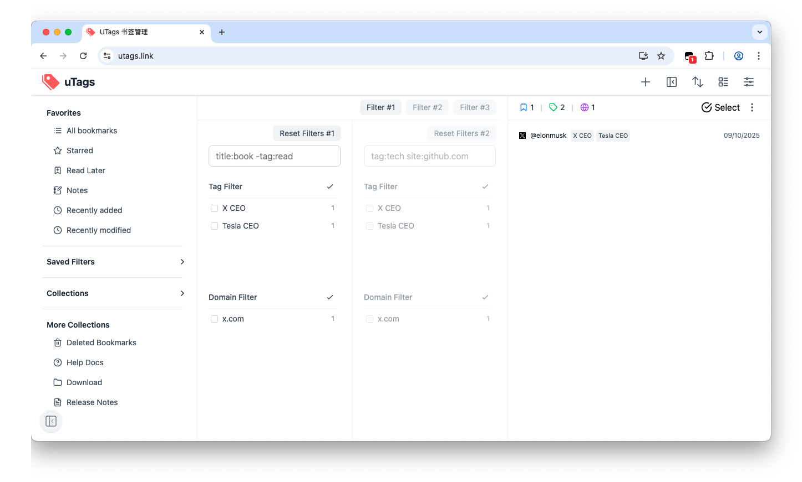

2. 点击"添加书签"按钮
3. 输入书签 URL、标题和标签

   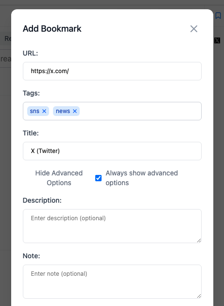

4. 点击保存
5. 使用左侧的标签筛选面板筛选书签
   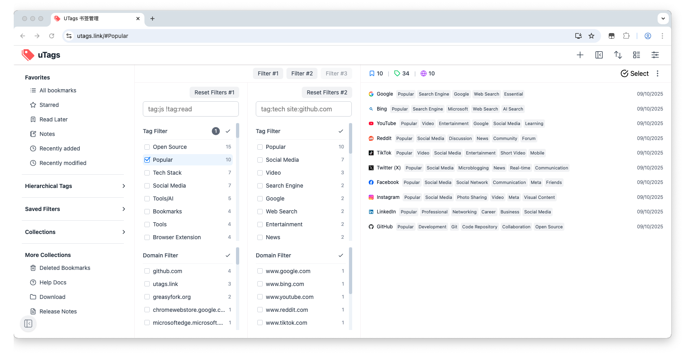

### 特殊标签使用

特殊标签可以实现特定的筛选效果：

- `block`，`hide` 或 `屏蔽`：隐藏带有此标签的内容
- `★` 或 `☆`：将内容标记为收藏
- `toread` 或 `稍后阅读`：将内容标记为稍后阅读

更多特殊标签详见[特殊标签使用](./special-tags.md)

### 导入浏览器书签

作为首次使用 UTags，您可以导入浏览器书签来快速开始：

1. **清空样本数据**（可选）：
   - 进入 UTags 设置页面
   - 找到"数据管理"部分
   - 点击"清空数据"选项，确认清空样本数据

2. **导入浏览器书签**（简易步骤）：
   - 从浏览器（Chrome/Firefox/Edge/Safari）导出书签为 HTML 文件
   - 在 UTags 设置中找到"导入/导出"选项
   - 上传书签文件并完成导入

> **提示**：导入后，您的浏览器文件夹结构会自动转换为标签，方便您立即体验 UTags 的强大筛选功能。

👉 详细的导入导出指南请参阅[数据导入导出](./data-import-export.md)文档。

### 数据同步设置

为了安全地将书签数据保存在云端并在多设备间同步，UTags 提供了简便的数据同步功能：

1. 在 UTags 网页应用或扩展的设置页面中选择"数据同步"
2. 选择适合您的同步方式：
   - **GitHub**：适合开发者，需要 GitHub 账号和个人访问令牌（PAT）
   - **WebDAV**：适合所有用户，支持 NextCloud、坚果云等服务
3. 按照界面提示完成配置并测试连接
4. 启用自动同步，设置同步频率（可选）

> **提示**：首次同步完成后，您可以在任何设备上访问相同的书签数据。

👉 详细的同步设置和故障排除指南请参阅[数据同步文档](./data-sync.md)。

## 下一步

现在您已经了解了 UTags 的基本安装和使用方法。接下来，您可以：

- 阅读[浏览器扩展/用户脚本使用指南](./extension-guide.md)，了解更多标签功能
- 阅读[网页应用使用指南](./webapp-guide.md)，掌握高级书签管理技巧
- 探索[数据同步](./data-sync.md)章节，设置多设备同步
- 查看[高级功能](./advanced-features.md)，发掘 UTags 的全部潜力
