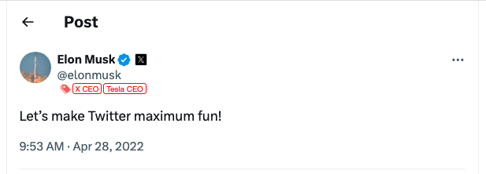

import BrowserWindow from '@site/src/components/BrowserWindow';

# Quick Start

This section will help you quickly get started with UTags, including installation, basic setup, and first-use guide.

## Installation Guide

### Choosing Between Browser Extension and User Script

UTags plugin supports two installation methods: browser extension and user script. You only need to install one of them, as their **basic functions** are the same. When choosing, you can refer to the following differences:

- **Browser Extension**: More feature-rich with higher browser integration
- **User Script**: More timely version updates, suitable for users who like to try new features

Choose the installation method that suits your usage habits and needs.

### Browser Extension Installation

UTags browser extension supports mainstream browsers such as Chrome, Firefox, Edge, etc. The installation steps are as follows:

- **Chrome**: [Chrome Web Store](https://chromewebstore.google.com/detail/utags-add-usertags-to-lin/kofjcnaphffjoookgahgjidofbdplgig)
- **Firefox**: [Firefox Add-ons](https://addons.mozilla.org/firefox/addon/utags/)
- **Edge**: [Edge Add-ons](https://microsoftedge.microsoft.com/addons/detail/utags-add-usertags-to-l/bhlbflbehfoccjjenpekilgabbjjnphe)

Installation steps:

1. Click the link corresponding to your browser above
2. Click the "Add to Browser" or "Install" button on the extension store page
3. Confirm installation
4. After installation is complete, the UTags icon will appear in the browser toolbar
5. It is recommended to pin the UTags icon to the toolbar for convenient daily use (right-click the icon and select "Pin to Toolbar" or a similar option)

### User Script Installation

User script is a lightweight browser extension method, suitable for those who want to keep their browser lightweight or don't want to install a complete extension. UTags provides a fully functional user script version, which you can install through the following steps:

#### Prerequisites

1. **Install a User Script Manager**: You need to first install one of the following user script managers:
   - [Tampermonkey](https://www.tampermonkey.net/) (Recommended, supports all mainstream browsers)
   - [Violentmonkey](https://violentmonkey.github.io/) (Open source option, suitable for Firefox/Chrome)
   - [ScriptCat](https://scriptcat.org/) (Chinese script manager with Chinese interface)
     

#### Installation Steps

1. Visit one of the following UTags user script release pages:

   - [Greasy Fork - UTags](https://greasyfork.org/scripts/460718-utags-add-usertags-to-links) (International user script platform)
   - [ScriptCat - UTags](https://scriptcat.org/script-show-page/2784) (Chinese user script platform)

2. Click the "Install this script" button on the page
   

3. Confirm installation in the user script manager window that pops up
   

4. After installation is complete, refresh the webpage to activate the script

5. Verify installation: Refresh the Greasy Fork or ScriptCat page you just visited, you should see the UTags "Settings" command menu
   

#### User Script Permission Settings

If you find that the user script is not working on webpages after installation, please check the following settings:

1. **Enable Browser Developer Mode** (required for some browsers):

   - **Chrome**: Visit `chrome://extensions/`, check "Developer mode" in the upper right corner
   - **Edge**: Visit `edge://extensions/`, turn on "Developer mode"
   - **Firefox**: Visit `about:addons`, click Extensions, then click the settings icon, select "Debug Add-ons"

2. **Check Script Manager Permissions**:
   - In the script manager's settings page, ensure that "Allow User Scripts" is enabled
   - Confirm that the script manager's website access permissions are set correctly (usually requires "All websites" permission)
   - Check if the UTags script is disabled or in a paused state

#### Troubleshooting

- **Script Not Working**: Try restarting the script manager, restarting the browser, or checking if there are any error messages in the script manager's console
- **Permission Issues**: Some websites may restrict user script execution; try setting permissions for that website separately in the script manager

### Web Application Access

The UTags web application (bookmark manager) does not need to be installed; you can access it directly through the following links:

- Main site: [https://utags.link](https://utags.link/)
- Alternative sites:
  - [https://utags.top](https://utags.top/)
  - [https://utags.github.io](https://utags.github.io/)

You can also add the web application to your home screen for a native app-like experience:

1. Visit the UTags web application
2. Select "Add to Home Screen" or "Install App" from the browser menu
3. Follow the prompts to complete installation

### Data Synchronization Configuration Between Browser Extension or User Script and Web Application

- After installing the extension or user script, visiting the web application for the first time will automatically add it.

<BrowserWindow url="https://utags.link/">
  
</BrowserWindow>

If it is not automatically added:

- Open the web application > Settings > Sync Settings, click Discover Targets
- Check if there are any new plugins appearing, if so, click to add them

<BrowserWindow url="https://utags.link/">
  
</BrowserWindow>
- Then click the "Sync Now" button to complete synchronization

<BrowserWindow url="https://utags.link/">
  
</BrowserWindow>

## First-Use Guide

### Adding Tags Using Browser Extension/User Script

1. Visit any supported website (such as Twitter, Reddit, GitHub, etc.)
2. Hover your mouse over a username, post title, or link

   

3. Click on the 🏷️ tag icon that appears
4. Enter tags in the popup input box, separating multiple tags with commas

   

5. Press Enter or click the confirm button to save the tags

   

### Managing Bookmarks Using the Web Application

1. Visit the UTags web application

   

2. Click the "Add Bookmark" button
3. Enter the bookmark URL, title, and tags

   

4. Click Save
5. Use the tag filtering panel on the left to filter bookmarks
   

### Using Special Tags

Special tags can achieve specific filtering effects:

- `block`, `hide` or `屏蔽`: Hide content with this tag
- `★` or `☆`: Mark content as favorite
- `toread` or `稍后阅读`: Mark content as read later

For more special tags, see [Special Tags Usage](./special-tags.md)

### Importing Browser Bookmarks

As a first-time user of UTags, you can import browser bookmarks to get started quickly:

1. **Clear Sample Data** (optional):

   - Go to the UTags settings page
   - Find the "Data Management" section
   - Click the "Clear Data" option, confirm to clear sample data

2. **Import Browser Bookmarks** (simple steps):
   - Export bookmarks from your browser (Chrome/Firefox/Edge/Safari) as an HTML file
   - Find the "Import/Export" option in UTags settings
   - Upload the bookmark file and complete the import

> **Tip**: After importing, your browser folder structure will be automatically converted to tags, allowing you to immediately experience UTags' powerful filtering functionality.

👉 For detailed import and export guides, please refer to the [Data Import and Export](./data-import-export.md) document.

### Data Synchronization Settings

To securely save bookmark data in the cloud and synchronize between multiple devices, UTags provides a simple data synchronization function:

1. Select "Data Synchronization" in the settings page of the UTags web application or extension
2. Choose the synchronization method that suits you:
   - **GitHub**: Suitable for developers, requires a GitHub account and Personal Access Token (PAT)
   - **WebDAV**: Suitable for all users, supports services like NextCloud, Jianguoyun, etc.
3. Follow the interface prompts to complete configuration and test the connection
4. Enable automatic synchronization and set synchronization frequency (optional)

> **Tip**: After the first synchronization is complete, you can access the same bookmark data on any device.

👉 For detailed synchronization settings and troubleshooting guides, please refer to the [Data Synchronization Documentation](./data-sync.md).

## Next Steps

Now that you understand the basic installation and usage methods of UTags. Next, you can:

- Read the [Browser Extension/User Script Usage Guide](./extension-guide.md) to learn more about tag functions
- Read the [Web Application Usage Guide](./webapp-guide.md) to master advanced bookmark management techniques
- Explore the [Data Synchronization](./data-sync.md) section to set up multi-device synchronization
- Check out [Advanced Features](./advanced-features.md) to discover the full potential of UTags
