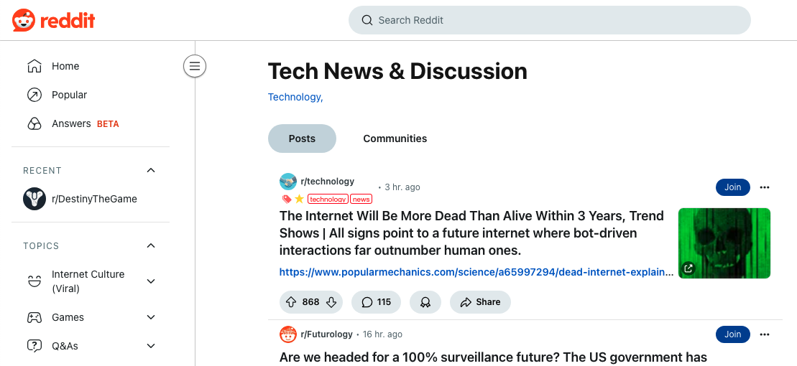

# 高级功能

:::info
未整理完
:::

本章节将详细介绍 UTags 的高级功能，帮助您充分发挥 UTags 的潜力，实现更高效的内容组织和管理。

## 正则表达式筛选

### 基本概念

正则表达式是一种强大的文本匹配模式，UTags 支持在搜索和筛选中使用正则表达式，实现更精确的内容筛选。

### 在搜索中使用正则表达式

1. 在 UTags 网页应用的搜索框中，使用斜杠 (`/`) 包围正则表达式
2. 例如，要搜索所有以 "http" 或 "https" 开头的 URL，可以使用 `/^https?:\/\//`
3. 点击搜索按钮或按回车键执行搜索



### 常用正则表达式示例

- **匹配域名**：`/^https?:\/\/([^\/]+\.)?example\.com\//`
- **匹配日期格式**：`/\d{4}-\d{2}-\d{2}/`
- **匹配电子邮件**：`/[a-zA-Z0-9._%+-]+@[a-zA-Z0-9.-]+\.[a-zA-Z]{2,}/`
- **匹配标签中的特定模式**：`/tag:tech\/.*/`

### 高级筛选技巧

1. **组合正则表达式与标签筛选**：

   - 先使用标签筛选缩小范围
   - 再使用正则表达式进一步精确筛选

2. **使用正则表达式排除内容**：

   - 使用否定前瞻 (`/^(?!.*pattern).*$/`) 排除包含特定模式的内容

3. **保存复杂的正则表达式筛选**：
   - 创建并保存包含正则表达式的筛选条件
   - 为复杂的正则表达式添加注释，便于日后理解

## 标签层次结构管理

### 设计标签层次结构

标签层次结构可以帮助您更有条理地组织内容。以下是设计有效标签层次结构的建议：

1. **顶层类别**：使用广泛的类别作为顶层标签，如 `技术`、`工作`、`个人`
2. **中层细分**：在顶层类别下创建更具体的子类别，如 `技术/编程`、`技术/设计`
3. **底层具体**：使用最具体的标签作为底层，如 `技术/编程/JavaScript`

### 创建和编辑层次结构

1. **创建层次结构**：

   - 在添加标签时使用斜杠分隔层级，如 `技术/编程/JavaScript`
   - UTags 会自动创建相应的层次结构

   

2. **编辑层次结构**：

   - 在 UTags 网页应用的设置中选择"标签管理"
   - 使用拖放操作调整标签的层次关系
   - 重命名标签时，可以修改其在层次结构中的位置

   

3. **合并标签**：

   - 在标签管理界面中，选择要合并的标签
   - 指定目标标签（可以是不同层次结构中的标签）
   - 确认合并操作

   

### 使用层次结构进行高级筛选

1. **层级筛选**：

   - 点击父标签可以筛选出包含该父标签或其任何子标签的内容
   - 点击子标签只筛选出包含该特定子标签的内容

2. **跨层级组合**：

   - 选择不同层次结构中的多个标签
   - 使用 AND/OR/NOT 逻辑组合筛选条件

3. **层级展开/折叠**：
   - 使用展开/折叠按钮控制层次结构的显示
   - 在复杂的层次结构中，可以只展开感兴趣的部分

## 自定义样式详解

### CSS 自定义

UTags 允许使用自定义 CSS 来修改标签和界面的外观：

1. **访问自定义 CSS**：

   - 在浏览器扩展/用户脚本的设置中选择"高级设置"
   - 在网页应用的设置中选择"外观设置"->"自定义 CSS"

2. **标签样式自定义**：

```css
/* 自定义普通标签样式 */
.utags-tag {
  font-family: 'Arial', sans-serif;
  font-size: 12px;
  padding: 2px 6px;
  margin: 0 2px;
  border-radius: 12px;
  background-color: #f0f0f0;
  color: #333;
  border: 1px solid #ccc;
}

/* 自定义特殊标签样式 */
.utags-tag[data-tag='favorite'] {
  background-color: #ffe066;
  color: #333;
  border-color: #ffd700;
}

/* 自定义标签悬停效果 */
.utags-tag:hover {
  background-color: #e0e0e0;
  transform: scale(1.05);
  transition: all 0.2s ease;
}
```

3. **界面元素自定义**：

```css
/* 自定义标签输入框 */
.utags-input {
  border: 2px solid #3498db;
  border-radius: 8px;
  padding: 6px 10px;
  font-size: 14px;
}

/* 自定义标签图标 */
.utags-icon {
  color: #3498db;
  font-size: 16px;
}

/* 自定义弹出菜单 */
.utags-menu {
  background-color: #ffffff;
  border: 1px solid #e0e0e0;
  border-radius: 8px;
  box-shadow: 0 4px 8px rgba(0, 0, 0, 0.1);
}
```

### 基于标签内容的样式

您可以根据标签的内容自定义样式：

```css
/* 为包含特定文本的标签设置样式 */
.utags-tag[data-tag*='重要'] {
  background-color: #ff6b6b;
  color: white;
  font-weight: bold;
}

/* 为特定层次结构的标签设置样式 */
.utags-tag[data-tag^='工作/'] {
  background-color: #74b9ff;
  color: #2d3436;
}

/* 为特定域名的标签设置样式 */
.utags-domain[data-domain='github.com'] {
  background-color: #333;
  color: white;
}
```


### 主题自定义

您可以创建完整的自定义主题：

```css
/* 暗色主题自定义 */
.dark-theme {
  --background-color: #1a1a1a;
  --text-color: #f0f0f0;
  --primary-color: #3498db;
  --secondary-color: #2ecc71;
  --border-color: #333;
  --card-background: #2d2d2d;
}

/* 亮色主题自定义 */
.light-theme {
  --background-color: #f9f9f9;
  --text-color: #333;
  --primary-color: #3498db;
  --secondary-color: #2ecc71;
  --border-color: #e0e0e0;
  --card-background: #ffffff;
}
```

### 动画效果自定义

您可以添加自定义动画效果：

```css
/* 标签添加动画 */
@keyframes tagAppear {
  from {
    opacity: 0;
    transform: scale(0.8);
  }
  to {
    opacity: 1;
    transform: scale(1);
  }
}

.utags-tag.new {
  animation: tagAppear 0.3s ease-out;
}

/* 标签悬停动画 */
.utags-tag:hover {
  transform: translateY(-2px);
  box-shadow: 0 2px 4px rgba(0, 0, 0, 0.1);
  transition: all 0.2s ease;
}
```

## API 集成

### API 概述

UTags 提供 API，允许其他应用程序和脚本与 UTags 交互：

1. **浏览器扩展 API**：允许其他扩展与 UTags 交互
2. **用户脚本 API**：允许其他用户脚本与 UTags 交互
3. **网页应用 API**：允许外部应用程序与 UTags 网页应用交互

### 浏览器扩展/用户脚本 API

#### 添加标签

```javascript
// 向页面元素添加标签
window.postMessage(
  {
    type: 'utags:addTag',
    data: {
      url: 'https://example.com/page', // 目标 URL
      selector: '#element-id', // 元素选择器
      tags: ['标签1', '标签2'], // 要添加的标签
    },
  },
  '*'
)

// 监听操作结果
window.addEventListener('message', function (event) {
  if (event.data.type === 'utags:addTagResult') {
    console.log('添加标签结果:', event.data.success)
  }
})
```

#### 获取标签

```javascript
// 获取页面元素的标签
window.postMessage(
  {
    type: 'utags:getTags',
    data: {
      url: 'https://example.com/page', // 目标 URL
      selector: '#element-id', // 元素选择器
    },
  },
  '*'
)

// 监听获取结果
window.addEventListener('message', function (event) {
  if (event.data.type === 'utags:getTagsResult') {
    console.log('元素标签:', event.data.tags)
  }
})
```

### 网页应用 API

#### 添加书签

```javascript
// 添加书签到 UTags 网页应用
fetch('https://utags.link/api/bookmarks', {
  method: 'POST',
  headers: {
    'Content-Type': 'application/json',
    Authorization: 'Bearer YOUR_API_KEY',
  },
  body: JSON.stringify({
    url: 'https://example.com/page',
    title: '示例页面',
    tags: ['标签1', '标签2'],
    description: '这是一个示例页面',
  }),
})
  .then((response) => response.json())
  .then((data) => console.log('添加书签结果:', data))
```

#### 获取书签

```javascript
// 获取 UTags 网页应用中的书签
fetch('https://utags.link/api/bookmarks?tags=标签1,标签2', {
  method: 'GET',
  headers: {
    Authorization: 'Bearer YOUR_API_KEY',
  },
})
  .then((response) => response.json())
  .then((data) => console.log('书签列表:', data))
```

### API 密钥管理

要使用 UTags API，您需要生成 API 密钥：

1. 在 UTags 网页应用的设置中选择"API 设置"
2. 点击"生成新 API 密钥"
3. 为 API 密钥添加描述和权限
4. 复制生成的 API 密钥（注意：密钥只会显示一次）
5. 在您的应用程序中使用该 API 密钥进行身份验证

### API 使用限制

- **请求频率**：每个 API 密钥有请求频率限制，超过限制会被暂时阻止
- **权限范围**：API 密钥可以设置不同的权限范围（只读、读写等）
- **IP 限制**：可以限制 API 密钥只能从特定 IP 地址使用

## 高级筛选技巧

### 复合筛选条件

您可以创建复杂的复合筛选条件：

1. **多维度筛选**：

   - 同时使用标签、域名和关键词筛选
   - 例如：筛选带有 "技术" 标签、来自 "github.com" 域名且包含 "JavaScript" 关键词的书签

2. **嵌套逻辑**：

   - 使用括号创建嵌套的逻辑条件
   - 例如：`(标签1 AND 标签2) OR (标签3 AND 标签4)`

3. **排除条件**：
   - 使用 NOT 操作符排除特定条件
   - 例如：筛选带有 "技术" 标签但不包含 "已读" 标签的书签

### 动态筛选

1. **保存筛选视图**：

   - 创建并保存常用的筛选条件
   - 为保存的筛选条件添加快捷键

2. **筛选链**：

   - 创建筛选条件的序列
   - 按特定顺序应用筛选条件，逐步缩小范围

3. **时间筛选**：
   - 使用添加时间筛选书签
   - 例如：筛选最近 7 天添加的书签

### 高级搜索语法

1. **精确匹配**：

   - 使用引号包围短语进行精确匹配
   - 例如：`"精确短语"`

2. **字段限定**：

   - 限定搜索特定字段
   - 例如：`title:关键词` 或 `url:example.com`

3. **通配符**：

   - 使用 `*` 和 `?` 进行模糊匹配
   - 例如：`program*` 匹配 "program"、"programming" 等

4. **组合搜索**：
   - 使用 AND、OR、NOT 组合多个搜索条件
   - 例如：`技术 AND (JavaScript OR Python) NOT 初级`

## 高级用例

### 知识管理系统

您可以使用 UTags 构建个人知识管理系统：

1. **知识分类**：

   - 使用层次化标签组织知识领域
   - 例如：`知识/编程/JavaScript`、`知识/设计/UI`

2. **学习路径**：

   - 使用标签标记学习进度
   - 例如：`学习/待学`、`学习/进行中`、`学习/已完成`

3. **知识关联**：
   - 使用相关标签建立知识点之间的联系
   - 使用特定标签标记核心概念和重要资源

### 项目管理

您可以使用 UTags 辅助项目管理：

1. **项目分类**：

   - 使用项目名称作为顶层标签
   - 例如：`项目A/需求`、`项目A/设计`、`项目A/开发`

2. **任务跟踪**：

   - 使用状态标签跟踪任务进度
   - 例如：`待办`、`进行中`、`已完成`、`已归档`

3. **资源整合**：
   - 收集和组织项目相关的所有资源
   - 使用标签关联不同来源的项目资料

### 研究工作流

研究人员可以使用 UTags 构建研究工作流：

1. **文献管理**：

   - 使用标签组织研究文献
   - 例如：`文献/方法论`、`文献/案例研究`、`文献/综述`

2. **引用跟踪**：

   - 使用标签标记引用关系
   - 例如：`引用/重要`、`引用/争议`、`引用/支持论点`

3. **研究进展**：
   - 使用标签记录研究进展
   - 例如：`研究/数据收集`、`研究/分析`、`研究/结论`
