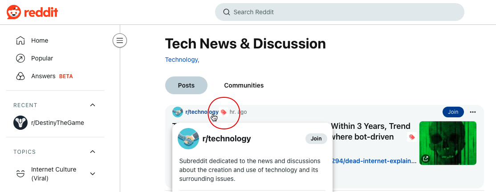
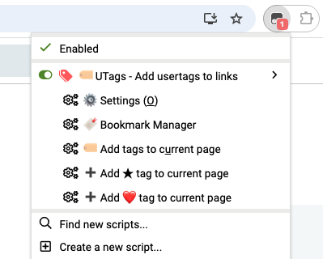
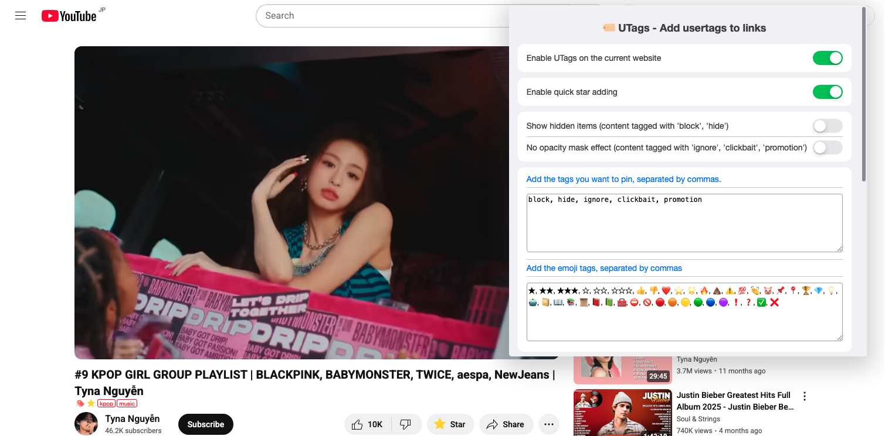
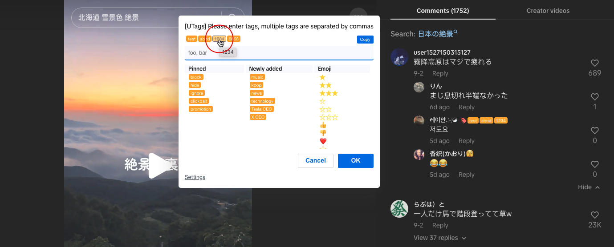
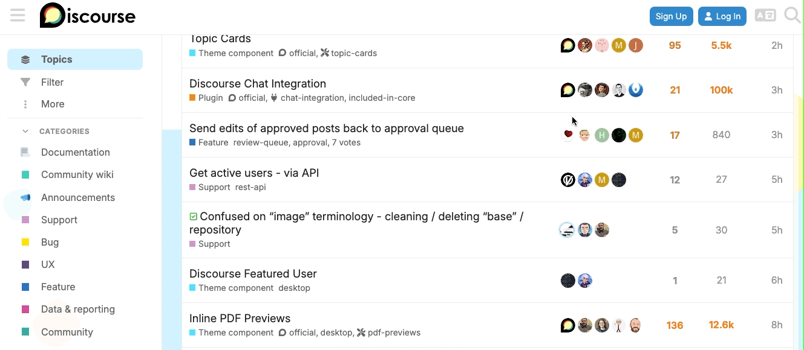

import BrowserWindow from '@site/src/components/BrowserWindow';

# 浏览器扩展/用户脚本使用指南

本章节将详细介绍 UTags 浏览器扩展和用户脚本的使用方法，帮助您充分利用网页标签功能，提升网页浏览体验。

## 界面介绍

### 主要界面元素

安装并启用 UTags 浏览器扩展或用户脚本后，您会在网页上看到以下界面元素：

1. **标签图标 (🏷️)**：当您将鼠标悬停在支持的元素（如用户名、帖子、链接等）上时，会出现一个标签图标，用于添加或编辑标签

<BrowserWindow url="https://www.reddit.com/">
  
</BrowserWindow>

2. **标签输入框**：点击标签图标后出现，用于输入和编辑标签

<BrowserWindow url="https://www.reddit.com/">

</BrowserWindow>

3. **标签显示**：已添加的标签会显示在元素旁边或下方

<BrowserWindow url="https://www.reddit.com/">

</BrowserWindow>

4. **扩展图标**：浏览器工具栏中的 UTags 图标，点击可访问设置和其他功能

   

:::info
浏览器扩展版本暂时不支持 popup 菜单。此功能即将到来。
:::

### 设置面板

点击浏览器工具栏中的 UTags 图标，然后选择"设置"，可以访问设置面板。设置面板包含以下主要选项：

1. **通用设置**：语言、界面样式等基本设置
2. **标签设置**：标签显示方式、颜色、大小等
3. **特殊标签**：特殊标签的行为设置
4. **浏览记录**：是否启用浏览记录功能，浏览过的内容的显示方式
5. **快速星标**：是否启用快速添加星标
   <!-- 5. **快捷键**：键盘快捷键设置 -->
   <!-- 6. **关于**：版本信息和帮助链接 -->
   <BrowserWindow url="https://www.youtube.com/">
   
   </BrowserWindow>

## 标签操作

### 为网页元素添加标签

1. 将鼠标悬停在支持的元素上（如用户名、帖子标题、链接等）
2. 点击出现的标签图标 (🏷️)
3. 在弹出的输入框中输入标签
   - 多个标签用逗号分隔，如 `重要,工作,待读`
   - 标签支持空格和特殊字符
   - 可以使用层次结构，如 `技术/编程/JavaScript`
4. 按回车键或点击确认按钮保存标签

<BrowserWindow url="https://www.reddit.com/">
  
</BrowserWindow>

### 编辑已有标签

1. 将鼠标悬停在已有标签上
2. 点击标签图标
3. 点击"复制"按钮，将标签复制到输入框，进行编辑
4. 按回车键或点击确认按钮保存更改
<!-- 3. 在弹出的输入框中编辑标签 -->

  <BrowserWindow url="https://www.tiktok.com/">
   
  </BrowserWindow>
  <BrowserWindow url="https://www.tiktok.com/">
   
  </BrowserWindow>

### 删除标签

1. 将鼠标悬停在已有标签上
2. 点击标签图标
3. 在弹出的输入框中删除不需要的标签
4. 按回车键或点击确认按钮保存更改
<!-- 4. 如果要删除所有标签，清空输入框 -->

  <BrowserWindow url="https://www.tiktok.com/">
   
  </BrowserWindow>

<!-- ### 批量操作

在某些支持的网站上，UTags 提供批量操作功能：

1. 在页面上选择多个元素（如多个帖子或链接）
2. 使用快捷键（默认为 `Alt+T`）或右键菜单中的"批量添加标签"
3. 在弹出的对话框中输入要添加的标签
4. 点击确认按钮应用到所有选中的元素 -->

## 特殊标签功能

特殊标签是具有特定功能的标签，可以实现内容筛选、高亮和其他效果，提升浏览体验。

:::info
目前仅部分网站适配了此功能，其他网站如果需要此功能，请[联系开发者](/contact)。
:::

### 常用特殊标签

- **`block`** 或 **`hide`**：屏蔽带有此标签的内容，使其不再显示
- **`favorite`** 或 **`★`**：将内容标记为收藏，通常会高亮显示
- **`important`**：标记重要内容，通常会高亮显示
- **`read-later`**：标记稍后查看的内容
  <!-- - **`read`**：将内容标记为已读，通常会改变显示样式 -->
  <!-- - **`nsfw`**：标记不适合工作场所查看的内容，默认会模糊处理 -->

### 特殊标签的使用方法

1. 像添加普通标签一样添加特殊标签
2. 特殊标签会立即生效，改变内容的显示方式
3. 可以在设置中自定义特殊标签的行为

<BrowserWindow url="https://meta.discourse.org/">

</BrowserWindow>

<!--
### 自定义特殊标签

您可以在设置中自定义特殊标签的行为：

1. 打开 UTags 设置
2. 选择"特殊标签"选项卡
3. 添加新的特殊标签或修改现有特殊标签的行为
4. 设置标签的效果（如隐藏、高亮、模糊等）
5. 保存设置
-->

更多特殊标签详见[特殊标签使用](./special-tags.md)。

## 标签管理

> ⚠️ **注意**：标签管理功能仅在 UTags 网页应用（书签管理器）中提供，浏览器扩展不直接支持这些高级标签管理功能。

要管理您的标签（查看、重命名、合并或删除），请访问 UTags 网页应用：

1. 打开 [UTags 网页应用](https://utags.link)
2. 设置同步功能，确保浏览器扩展与网页应用保持同步（默认自动添加，无同步配置时，请参考手动添加配置方法）
3. 点击左侧边栏中的"标签"选项

在网页应用中，您可以执行以下标签管理操作：

- **查看所有标签**：左侧边栏的"标签"部分显示所有标签及其使用次数
- **重命名标签**：点击标签旁的编辑图标，输入新名称并保存
- **合并标签**：选择要合并的标签，使用合并功能将它们组合
- **删除标签**：点击标签旁的删除图标，确认删除操作


> 💡 **提示**：使用网页应用进行标签管理可提供更强大的功能和更好的用户体验。您在网页应用中所做的标签更改将通过同步功能自动应用到浏览器扩展。

## 自定义样式

<!--
### 标签显示样式

1. 打开 UTags 设置
2. 启用全局或当前网站的自定义样式
3. 添加自定义样式，可以设置标签的大小、颜色、背景、边框等
-->

<!--
2. 选择"标签设置"选项卡
3. 自定义以下选项：
   - 标签大小
   - 标签颜色
   - 标签背景
   - 标签边框
-->

   <!-- - 标签圆角 -->
   <!-- - 标签间距 -->
   <!-- - 标签位置（元素旁边或下方） -->

### 使用自定义 CSS

对于高级用户，UTags 支持使用自定义 CSS 样式来个性化标签显示：

1. 打开 UTags 设置
2. 启用全局或当前网站的自定义样式
3. 在"自定义 CSS"文本框中输入 CSS 代码
4. 保存设置

示例自定义 CSS：

<BrowserWindow url="https://utags.link/">

```css
/* 全局标签样式 */
body {
  /* 标签文字颜色 */
  --utags-text-tag-color: white;
  /* 标签边框颜色 */
  --utags-text-tag-border-color: red;
  /* 标签背景颜色 */
  --utags-text-tag-background-color: red;
}

/* 特定标签样式：标签为 'TEST' 的样式 */
[data-utags_tag='TEST'] {
  /* 标签文字颜色 */
  --utags-text-tag-color: white;
  /* 标签边框颜色 */
  --utags-text-tag-border-color: orange;
  /* 标签背景颜色 */
  --utags-text-tag-background-color: orange;
}

/* 列表项样式：含有 'bar' 标签的条目 */
[data-utags_list_node*=',bar,'] {
  /* 列表中含有 'bar' 标签的条目的背景色 */
  background-color: aqua;
}

/* 浏览历史样式 */
body {
  /* 浏览过的帖子的标题颜色 */
  --utags-visited-title-color: red;
}

/* 深色模式下的样式 */
[data-utags_darkmode='1'] body {
  /* 浏览过的帖子的标题颜色 */
  --utags-visited-title-color: yellow;
}
```

</BrowserWindow>

## 支持的网站列表

UTags 目前支持 50 多个主流网站，包括但不限于以下类别：

### 社交媒体

- Twitter/X
- Facebook
- Instagram
- Threads
  <!-- - LinkedIn -->
  <!-- - Mastodon -->

### 视频平台

- YouTube
- Bilibili
- TikTok
- Twitch
<!-- - Vimeo -->

### 开发平台

- GitHub
  <!-- - GitLab -->
  <!-- - Stack Overflow -->
  <!-- - CodePen -->

### 论坛和社区

- Reddit
- Hacker News
- Discourse 论坛
- Flickr
  <!-- - Discord -->
  <!-- - Telegram Web -->

### 新闻和阅读

- Inoreader
  <!-- - Medium -->
  <!-- - Substack -->
  <!-- - RSS 阅读器 -->
  <!-- - 主流新闻网站 -->

<!--
### 电商平台

- Amazon
- eBay
- AliExpress

### 其他

- Wikipedia
- Google 搜索结果
- Bing 搜索结果
-->

完整的支持网站列表可以在 [GitHub 仓库](https://github.com/utags/utags) 中查看。如果您希望 UTags 支持其他网站，欢迎在 GitHub 上提交请求或[联系开发者](/contact)。

<!--
## 键盘快捷键

UTags 提供以下默认键盘快捷键：

- **Alt+T**：为当前元素添加标签
- **Alt+Shift+T**：批量添加标签
- **Alt+B**：切换屏蔽标签的显示/隐藏
- **Alt+H**：切换隐藏标签的显示/隐藏
- **Alt+F**：将当前元素标记为收藏

您可以在设置中自定义这些快捷键。
-->

## 故障排除

### 标签不显示

如果标签不显示，请按照以下步骤排查问题：

1. 确保您访问的网站在支持列表中
2. 刷新页面（按 F5 或 Ctrl+R）
3. 检查浏览器扩展或用户脚本是否启用（在浏览器的扩展管理页面或用户脚本管理页面）
4. 检查是否有其他扩展与 UTags 冲突（尝试暂时禁用其他扩展或用户脚本）
5. 在 UTags 设置中检查标签显示选项是否正确配置

### 同步问题

如果遇到数据同步问题，请按照以下步骤排查：

1. 检查同步设置是否正确配置
2. 是否配置浏览器扩展或用户脚本与网页应用之间的同步配置，并启用自动同步功能
3. 确保网络连接正常且稳定
4. 对于 GitHub 同步，检查个人访问令牌是否有效且具有正确权限
5. 对于 WebDAV 同步，检查服务器地址、用户名和密码是否正确
6. 尝试手动触发同步并查看错误信息

### 性能问题

如果遇到性能问题（如页面加载缓慢或响应延迟），请尝试以下解决方法：

1. 更新浏览器和 UTags 扩展到最新版本
2. 向开发者[反馈问题](https://github.com/utags/utags/issues)，并提供详细的问题描述和复现步骤

<!-- 1. 减少使用的标签数量 -->
<!-- 2. 在设置中禁用不需要的功能 -->
<!-- 3. 清除浏览器缓存 -->

## 获取帮助

如果您在使用 UTags 浏览器扩展或用户脚本时遇到任何问题，或有任何建议和反馈，可以通过以下方式获取帮助：

1. 查阅[常见问题解答](./faq.md)（FAQ）
2. 在 [GitHub Issues](https://github.com/utags/utags/issues) 提交问题报告
3. 访问[联系页面](/contact)获取更多支持渠道

```

```
